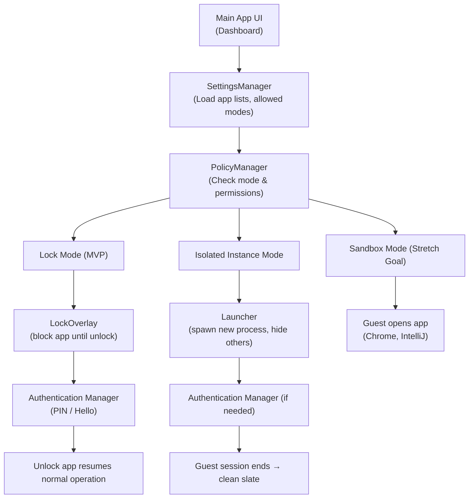

# AppLock

## Problem Statement
Windows lacks an app-by-app locking mechanism such as the iOS FaceID App Lock. This tool is used to provide instant per-app privacy with optional guest/clean-slate modes.

## Target Use Cases
- Primary User allows a guest user to use their Windows device while maintaining privacy.

## Tech Stack
- **Language:** C# (.NET 8, WPF/WinForms)  
- **APIs:** Win32 (`user32.dll`, `kernel32.dll`) for window focus detection, process spawning, hotkeys.  
- **Others:** Windows Hello via `Windows.Security.Credentials` API.

## Requirements
- **Instantly lock certain apps** when not in use or out of focus  
    - **Definitions of when to lock:**  
        - App is minimized  
        - App was closed and reopened  
        - Manual lock via hotkey  
    - **What is locked:**  
        - **Default Mode:**  
            - Entire App  
            - Current Instances of App  
        - **Isolated Instances (Stretch Goal 1):**  
            - App intercepts and spawns fresh Notepad process  
            - Existing Notepad instances are hidden/locked  
        - **Advanced (Stretch Goal 2):**  
            - Incognito Mode allowed for browsers  
            - Clean slates for Notepad, current stuff is blocked  
            - Profile-less openings  
    - **App allows for customization of rules:**  
        - Customize allowed apps  
        - Customize banned apps  
        - Customization of Modes  
    - **Locking and Unlocking Mechanism:**  
        - Lock via Windows hotkey or through the App  
        - Unlock via device password, Windows Hello, or biometrics

## High-Level Architecture
- **Modules/Components:**  
    - **Main App/Dashboard:** Displays protected apps, modes, and settings; allows manual lock/unlock  
    - **SettingsManager:** Loads/saves user preferences: protected apps, allowed apps, modes  
    - **PolicyManager:** Tracks which apps are protected and in which mode (Lock, Isolated Instance, Sandbox)  
    - **WindowMonitor:** Watches active windows, detects minimizes, closes, and manual lock  
    - **Lock Overlay:** Displays transparent/blur overlay to block interaction with locked apps  
    - **Launcher:** Spawns apps in Isolated Instance or Sandbox Mode, redirects profiles/temp folders  
    - **HotkeyManager:** Registers global hotkeys for manual lock/unlock  
    - **AuthenticationManager:** Handles unlocking via Windows Hello, password, or biometrics  
    - **Utils / Helpers:** Shared code for process management, logging, cleanup, etc.

## Conceptual Flow
1. User opens AppLock → Main App loads settings via SettingsManager  
2. WindowMonitor starts watching all protected apps  
3. If a protected app is minimized, covered, or closed → PolicyManager decides action  
4. Action = Lock → LockOverlay blocks app until AuthenticationManager verifies user  
5. Guest wants a clean Notepad file → Launcher spawns fresh Notepad process in Isolated Mode  
6. User changes rules/settings → SettingsManager updates configuration

## Diagram
